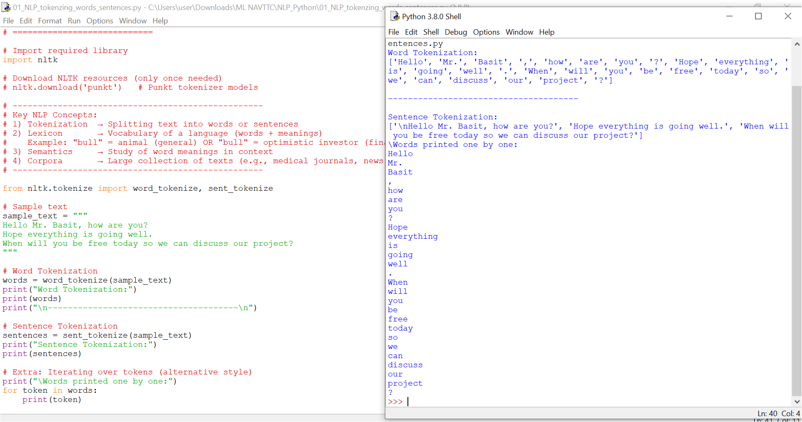

# 01_NLP_tokenzing_words_sentences

### 📌 Introduction
In Natural Language Processing (NLP), one of the very first steps is **tokenization**.  
Tokenization means splitting text into smaller units so a computer can analyze them more effectively.

There are two common types:
1. **Word Tokenization** → Breaks text into individual words/tokens.  
   Example: *"Hope everything is going well."* → `['Hope', 'everything', 'is', 'going', 'well', '.']`  

2. **Sentence Tokenization** → Splits text into complete sentences.  
   Example:  
   "Hello Mr. Basit, how are you? Hope everything is going well."  
   → ["Hello Mr. Basit, how are you?", "Hope everything is going well."]

---

### 🖼 Example Output
The screenshot below shows the output of the program:



---

### 🚀 How to Run
You can run this file in **VS Code**, PyCharm, Jupyter Notebook, or any Python environment:

```bash
python 01_NLP_tokenzing_words_sentences.py
```

---

### ✅ Key Takeaways
- **Tokenization** is the foundation of most NLP tasks.  
- Splitting text into words and sentences makes it easier to apply further techniques like:
  - Stop word removal  
  - Stemming  
  - Lemmatization  
  - Part-of-speech tagging  

This script demonstrates how **NLTK’s `word_tokenize` and `sent_tokenize`** functions make tokenization quick and simple.

