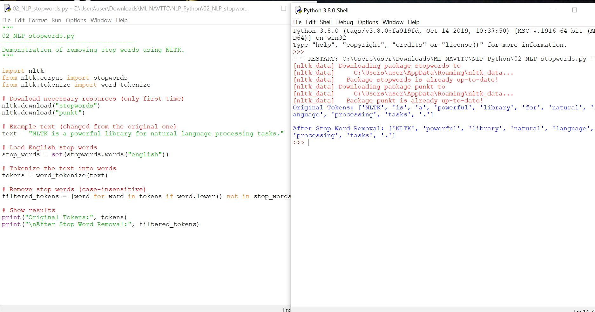

# 02_NLP_stopwords

### 📌 What are Stop Words?
In Natural Language Processing (NLP), **stop words** are very common words  
such as *“is”*, *“the”*, *“an”*, *“at”*, etc.  
They occur so often in text that they rarely add meaningful information.  

For example:  
- Original: *“NLTK is a powerful library for natural language processing tasks.”*  
- After removing stop words: *“NLTK powerful library natural language processing tasks .”*

By removing these words, we make our text data cleaner and more useful for analysis.

---

### 🖼 Example Output
The screenshot below shows the output of the code:



---

### 🚀 How to Run
You can run this file in **VS Code**, PyCharm, or any Python environment:

```bash
python 02_NLP_stopwords.py
