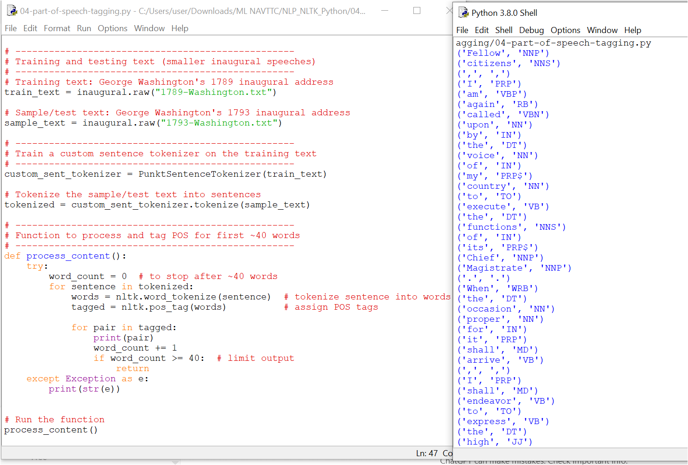

# Part of Speech Tagging with NLTK

In this example, we explore **Part of Speech (POS) Tagging** using the NLTK library.  
POS tagging means labeling each word in a text as a noun, verb, adjective, adverb, etc.  
This provides structure and context to plain text and is an important step in NLP.

---

## 🔹 How it Works
1. We use **inaugural speeches** from the NLTK corpus:
   - `1789-Washington.txt` → training text
   - `1793-Washington.txt` → testing text  
2. The `PunktSentenceTokenizer` is trained on the first text to learn sentence structures.  
3. The second text is tokenized into words, and then each word is **tagged** with its part of speech using `nltk.pos_tag`.  
4. We print the first ~40 tagged words for demonstration.

---

## 📷 Example Output


---

## 🔑 Full POS Tag List (Penn Treebank Tags)

| Tag   | Meaning | Example |
|-------|----------|---------|
| **CC** | Coordinating conjunction | and, but, or |
| **CD** | Cardinal digit | one, two, 3 |
| **DT** | Determiner | the, a, some |
| **EX** | Existential there | “there is”, “there exists” |
| **FW** | Foreign word | *c’est la vie* |
| **IN** | Preposition/subordinating conjunction | on, in, at |
| **JJ** | Adjective | big, red |
| **JJR** | Adjective, comparative | bigger, faster |
| **JJS** | Adjective, superlative | biggest, fastest |
| **LS** | List marker | 1), 2) |
| **MD** | Modal verb | could, will, might |
| **NN** | Noun, singular | desk, car |
| **NNS** | Noun, plural | desks, cars |
| **NNP** | Proper noun, singular | Washington, Alice |
| **NNPS** | Proper noun, plural | Americans, Europeans |
| **PDT** | Predeterminer | all, both |
| **POS** | Possessive ending | parent’s |
| **PRP** | Personal pronoun | I, he, she, we |
| **PRP$** | Possessive pronoun | my, his, hers |
| **RB** | Adverb | quickly, silently |
| **RBR** | Adverb, comparative | better, faster |
| **RBS** | Adverb, superlative | best, fastest |
| **RP** | Particle | give **up**, break **down** |
| **TO** | “to” | go **to** school |
| **UH** | Interjection | uh, um, wow |
| **VB** | Verb, base form | take, eat |
| **VBD** | Verb, past tense | took, ate |
| **VBG** | Verb, gerund/present participle | taking, eating |
| **VBN** | Verb, past participle | taken, eaten |
| **VBP** | Verb, present (non-3rd person) | run, eat |
| **VBZ** | Verb, 3rd person singular present | runs, eats |
| **WDT** | Wh-determiner | which, that |
| **WP** | Wh-pronoun | who, what |
| **WP$** | Possessive wh-pronoun | whose |
| **WRB** | Wh-adverb | where, when |

---

## ⚡ Why Train and Test Separately?
We train on one text (1789 speech) and test on another (1793 speech) to check how well the tokenizer and tagger **generalize**.  
If we used the same text for both, the model would be biased and results less meaningful.

---

## ▶️ How to Run
- Open `04-part-of-speech-tagging.py` in **VS Code** or any Python IDE.  
- Run the script:  
  ```bash
  python 04-part-of-speech-tagging.py
