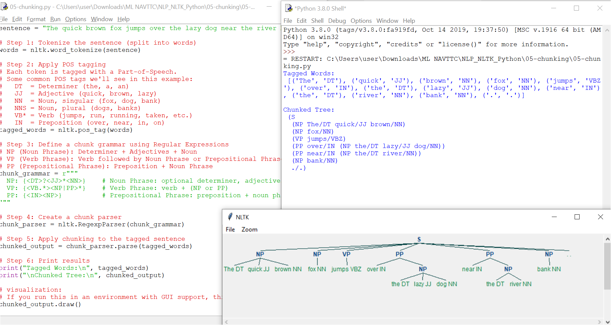

# 📘 05-chunking

This script demonstrates **chunking** in NLP (Natural Language Processing) using **NLTK**.  
Chunking means grouping words into meaningful phrases (like noun phrases, verb phrases) after they’ve been tagged with their Part-of-Speech (POS).

---

## 🚀 How it works
1. Tokenize the sentence → split into words.  
2. POS Tagging → label each word with its grammatical role.  
3. Chunk Grammar → define rules with regex-style patterns (e.g., noun phrase = Determiner + Adjective(s) + Noun).  
4. Chunk Parser → apply grammar to tagged words.  
5. Output → get a parse tree showing grouped phrases.

---

## ⚙️ Example Run

Input sentence:  
The quick brown fox jumps over the lazy dog near the river bank.

Tagged output (example):  
[('The', 'DT'), ('quick', 'JJ'), ('brown', 'JJ'), ('fox', 'NN'),  
 ('jumps', 'VBZ'), ('over', 'IN'), ('the', 'DT'), ('lazy', 'JJ'),  
 ('dog', 'NN'), ('near', 'IN'), ('the', 'DT'), ('river', 'NN'),  
 ('bank', 'NN'), ('.', '.')]

Chunked output (simplified):  
(NP The/DT quick/JJ brown/JJ fox/NN) (VP jumps/VBZ (PP over/IN (NP the/DT lazy/JJ dog/NN)))  
(PP near/IN (NP the/DT river/NN bank/NN)) ./.

---

## 📖 POS Tags Used

| Tag | Meaning | Example |
|-----|----------|---------|
| DT  | Determiner | the, a, an |
| JJ  | Adjective | quick, brown, lazy |
| NN  | Noun (singular) | fox, dog, bank |
| NNS | Noun (plural) | dogs, banks |
| VB  | Verb, base form | jump, run |
| VBZ | Verb, 3rd person present | jumps, runs |
| VBD | Verb, past tense | jumped |
| VBG | Verb, gerund/present participle | jumping |
| VBN | Verb, past participle | jumped |
| IN  | Preposition | over, near, in |

---

## 🛠 Regex Identifiers Recap

These are used in defining chunk grammar:

### Identifiers
- \d → any number  
- \D → anything but a number  
- \s → space  
- \S → anything but a space  
- \w → any letter  
- \W → anything but a letter  
- . → any character (except newline)  
- \b → space around whole words  
- \. → literal period (escape since `.` means any character)  

### Modifiers
- {1,3} → 1 to 3 repetitions  
- + → 1 or more  
- ? → 0 or 1  
- * → 0 or more  
- $ → end of string  
- ^ → start of string  
- | → either/or (x|y)  
- [] → range or set  
- {x} → exactly x repetitions  
- {x,y} → x to y repetitions  

### White Space
- \n → new line  
- \s → space  
- \t → tab  
- \e → escape  
- \f → form feed  
- \r → carriage return  

### Escape Characters
Remember to escape these if used literally:  
. + * ? [ ] $ ^ ( ) { } | \  

### Brackets
- [ ] → define set or alternatives  
- [a-z] → lowercase letters a–z  
- [1-5a-qA-Z] → digits 1–5, lowercase a–q, uppercase A–Z  
- quant[ia]tative → matches "quantitative" or "quantatative"  

---

## ▶️ Run Instructions

1. Install NLTK:  
   pip install nltk  

2. Download necessary datasets inside Python:  
   import nltk  
   nltk.download('punkt')  
   nltk.download('averaged_perceptron_tagger')  

3. Run the script:  
   python 05-chunking.py  

4. (Optional) Uncomment `.draw()` in the code to visualize the chunk tree in a GUI window.
