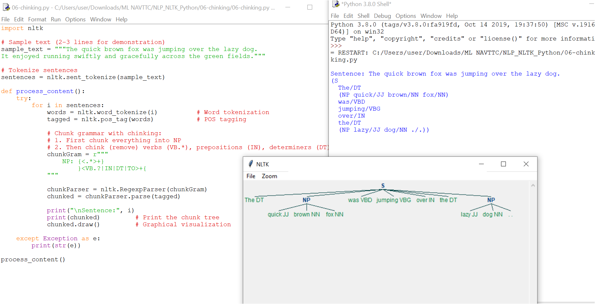

# 06 - Chinking in NLP (NLTK)

This folder contains the Python script `06-chinking.py` and its output screenshot `06-chinking.PNG`.

---

## 🔑 What is Chinking?

- **Chunking** groups words (based on POS tags) into meaningful units like noun phrases.  
- **Chinking** is the opposite: it **removes specific POS tags** from chunks.  

👉 For example, if chunking grabs everything in a sentence, chinking can remove verbs, prepositions, or determiners to leave behind only **nouns and adjectives**.

---

## 📖 How It Works

1. A short sample paragraph (2–3 lines) is tokenized into words.  
2. Each word is **POS-tagged** (e.g., `NN` = noun, `VB` = verb).  
3. Using a grammar rule:
   - First, everything is chunked into a big `NP`.  
   - Then verbs (`VB.*`), prepositions (`IN`), determiners (`DT`), and `TO` are **chinked out**.  
4. The remaining chunks are displayed as a **tree diagram**.

---

## 📊 Example Behavior

For the sentence:  

`"The quick brown fox was jumping over the lazy dog."`

- **Before chinking:**  
  Everything belongs to one big noun phrase (NP).  

- **After chinking:**  
  - Removed: `was` (verb), `jumping` (verb), `over` (preposition), `the` (determiner).  
  - Remaining in chunk: `quick`, `brown`, `fox`, `lazy`, `dog`.  

This highlights the **core descriptive words** while filtering functional ones.

---

## 📸 Output Screenshot

The tree diagram generated by the script is saved as:

---

## 📚 Why Chinking is Useful

- Refines chunks by **excluding irrelevant words**.  
- Makes it easier to focus on **nouns and adjectives** (key information).  
- Useful in:
  - Information extraction  
  - Named Entity Recognition (NER)  
  - Text analysis tasks  

---

## 🔠 POS Tag Reference (Common Tags)

| Tag  | Meaning | Example |
|------|----------|---------|
| DT   | Determiner | the, a |
| IN   | Preposition | in, over |
| JJ   | Adjective | quick, lazy |
| NN   | Noun, singular | dog, fox |
| NNS  | Noun, plural | dogs |
| NNP  | Proper noun, singular | John |
| PRP  | Pronoun | he, she |
| RB   | Adverb | swiftly |
| VB   | Verb (base form) | run |
| VBD  | Verb, past tense | ran |
| VBG  | Verb, gerund | running |
| VBN  | Verb, past participle | eaten |
| VBP  | Verb, non-3rd person present | take |
| VBZ  | Verb, 3rd person singular present | takes |

---

## 🔢 Regex Reference (used in grammar rules)

**Identifiers:**
- `\d` = any number  
- `\D` = anything but a number  
- `\s` = space  
- `\S` = anything but a space  
- `\w` = any letter  
- `\W` = anything but a letter  
- `.` = any character except new line  
- `\b` = space around whole words  
- `\.` = period (escaped)  

**Modifiers:**
- `{1,3}` = 1–3 repetitions  
- `+` = match 1 or more  
- `?` = match 0 or 1  
- `*` = match 0 or more  
- `$` = end of string  
- `^` = start of string  
- `|` = either/or  
- `{x}` = exactly x times  
- `{x,y}` = x–y times  

**Whitespace:**
- `\n` = new line  
- `\t` = tab  
- `\r` = carriage return  

**Escape characters:**  
`. + * ? [ ] $ ^ ( ) { } | \`

**Brackets Examples:**  
- `[a-z]` = lowercase letters  
- `[A-Z]` = uppercase letters  
- `[0-9]` = digits  
- `[1-5a-qA-Z]` = mix of ranges  

---
