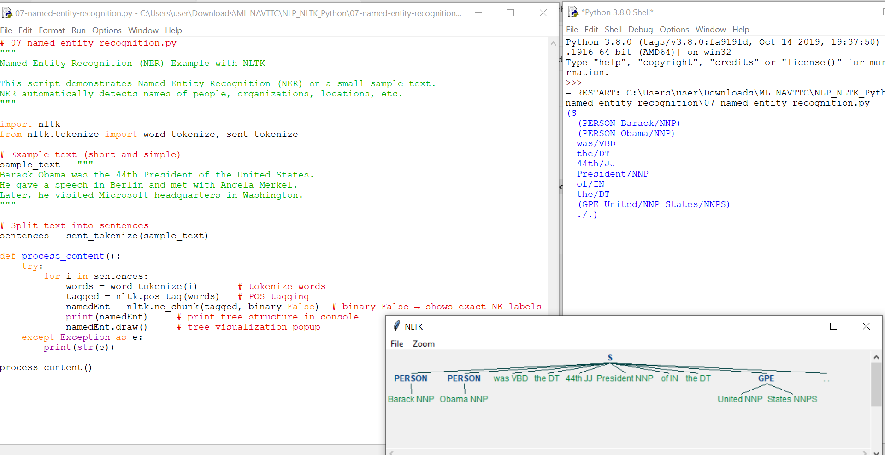

# 07 - Named Entity Recognition (NER) with NLTK

This folder contains the Python script `07-named-entity-recognition.py` and its output screenshot `07-named-entity-recognition.PNG`.

---

## What is NER?
**Named Entity Recognition (NER)** extracts and classifies real-world entities mentioned in text — for example, names of people, organizations, locations, dates, money amounts, etc.  
NER is widely used in search, summarization, chatbots, information extraction, and many other NLP tasks.

---

## Files in this folder
- `07-named-entity-recognition.py` — the script that runs NER on a short sample paragraph.  
- `07-named-entity-recognition.PNG` — screenshot / visualization of the NER output (tree diagram).

---

## Example text used
Barack Obama was the 44th President of the United States.  
He gave a speech in Berlin and met with Angela Merkel.  
Later, he visited Microsoft headquarters in Washington.

(Use your own text if you want different entities to appear.)

---

## Workflow (what the script does)
1. Split the paragraph into sentences and words (tokenization).  
2. Assign Part-of-Speech (POS) tags to tokens.  
3. Apply NLTK's NER chunker (`ne_chunk`) to identify entities and label them (PERSON, ORGANIZATION, GPE, etc.).  
4. Print the chunk/tree in the console and display a tree visualization window so you can capture a screenshot.

---

## Typical entities you will see
- **PERSON** — people’s names (e.g., Barack Obama, Angela Merkel)  
- **ORGANIZATION / ORG** — companies, institutions (e.g., Microsoft)  
- **GPE** — geopolitical entities: countries, cities, states (e.g., United States, Berlin, Washington)  
- **DATE / TIME** — dates and times  
- **MONEY** — monetary values  
- **PERCENT** — percentages  
- **LOCATION** — non-GPE locations (rivers, mountains, regions)  
- **FACILITY** — buildings, airports, highways

---

## How to run
1. Install NLTK if needed: `pip install nltk`  
2. In Python, ensure these NLTK resources are downloaded:
   - `punkt`
   - `averaged_perceptron_tagger`
   - `maxent_ne_chunker`
   - `words`  
   (You can download them via `import nltk` then `nltk.download('resource_name')`.)  
3. Run the script: `python 07-named-entity-recognition.py`  
4. A small tree window will open showing detected entities — take a screenshot and save it as `07-named-entity-recognition.PNG` (that file is referenced in this README).

---

## Key functions referenced (for quick reference)
- `sent_tokenize` / `word_tokenize` — split text into sentences / words  
- `pos_tag` — assign part-of-speech tags to tokens  
- `ne_chunk(tagged, binary=False)` — perform NER and return a tree with labels (set `binary=True` to collapse all entities into a single NE label)

---

## Why NER is useful
- Automatically extracts structured facts from raw text (people, places, organizations).  
- Speeds up downstream tasks like indexing, summarization, question-answering, and analytics.  
- Easy way to bootstrap knowledge extraction from plain documents.

---

## Screenshot (output)
The tree visualization produced by the script should be saved/seen as:

---
