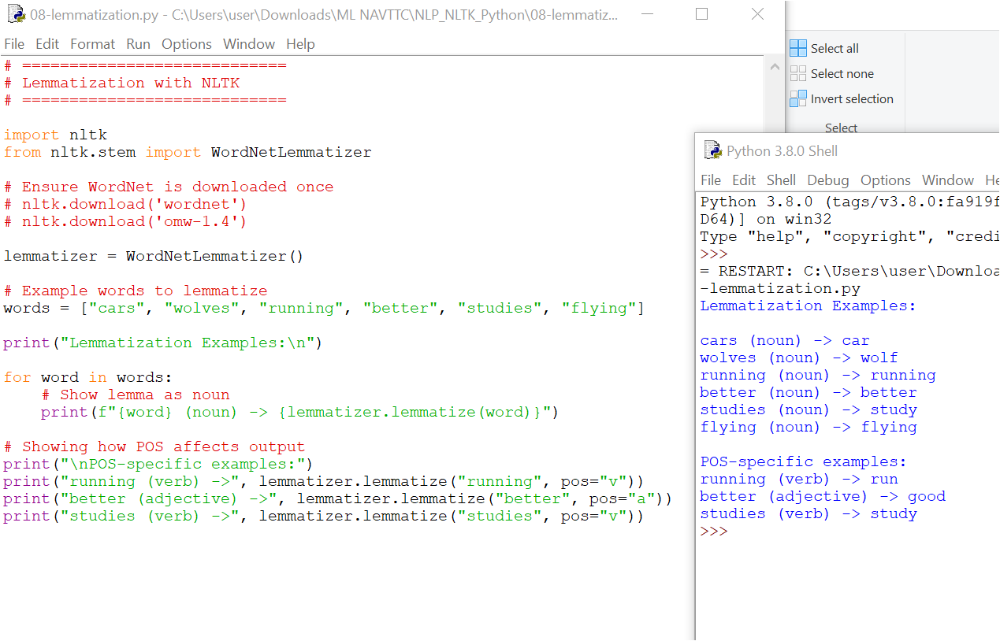

# 08 - Lemmatization with NLTK

This folder contains the Python script `08-lemmatization.py` and its output screenshot `08-lemmatization.PNG`.

---

## What is Lemmatization?
**Lemmatization** is the process of reducing a word to its **base or dictionary form (lemma)**.  
It is similar to **stemming**, but unlike stemming, the result is always a real word.  

### Example
- Stemming: `"studies"` → `"studi"` (not a real word)  
- Lemmatization: `"studies"` → `"study"` ✅  

---

## Why Lemmatization is useful
- Produces valid dictionary words.  
- Helps in text preprocessing for NLP tasks such as search, machine translation, and sentiment analysis.  
- More accurate than stemming, though slightly slower.  

---

## Key Difference from Stemming
| Aspect        | Stemming                  | Lemmatization              |
|---------------|---------------------------|----------------------------|
| Output        | May produce non-words     | Always dictionary words    |
| Approach      | Rule-based (suffix chopping) | Dictionary + POS analysis |
| Speed         | Faster                    | Slower (but more accurate) |

---

## POS (Part of Speech) in Lemmatization
- If no POS is given, default = **noun (`'n'`)**.  
- Providing the right POS gives better results:  

Examples:  
- `"better"` → lemma (noun) = `"better"`  
- `"better"` with `pos="a"` → `"good"` (adjective)  
- `"running"` → lemma (noun) = `"running"`  
- `"running"` with `pos="v"` → `"run"` (verb)

---

## Output
- 

---

