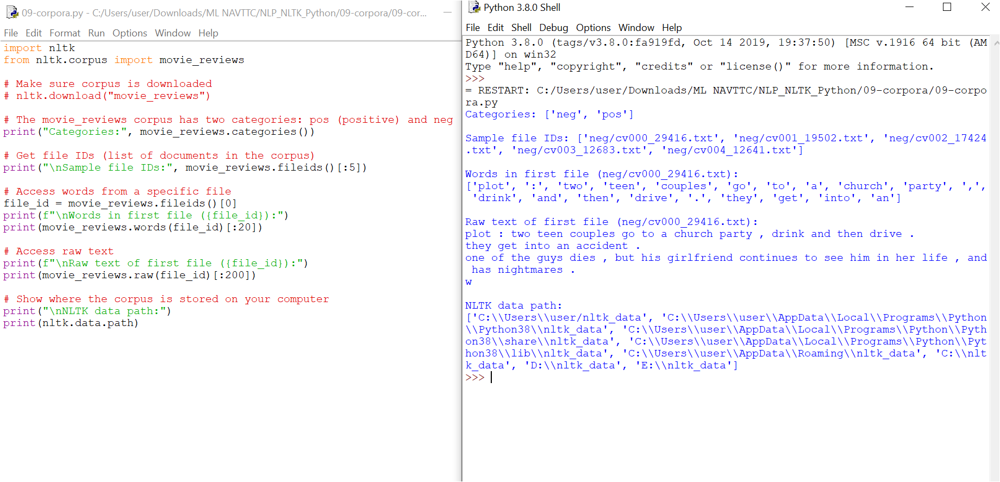

# 09 - NLTK Corpora Access (Movie Reviews Example)

This folder contains the Python script `09-corpora.py` and its output screenshot `09-corpora.PNG`.

---

## 📘 What is a Corpus?
A **corpus** is a large and structured collection of texts used for natural language processing (NLP).  
NLTK provides many corpora, including:

- **movie_reviews** → Positive & negative film reviews (useful for sentiment analysis)  
- **gutenberg** → Classic literature (Shakespeare, Bible, Jane Austen, etc.)  
- **brown** → Wide range of English texts  
- **wordnet** → Dictionary-like database (synonyms, antonyms, definitions, etc.)  

---

## 📂 Locating the `nltk_data` Directory
When you download corpora using `nltk.download()`, datasets are stored in the **nltk_data** folder.

### Typical locations:
- **Windows:**  
  `C:\Users\<YourName>\AppData\Roaming\nltk_data\corpora`
- **Linux / macOS:**  
  `/usr/share/nltk_data/corpora`  
  `/usr/local/share/nltk_data/corpora`  
  `/usr/lib/nltk_data/corpora`

---
## Output
- 


To check where NLTK is looking for corpora, run:

```python
import nltk
print(nltk.data.path)


