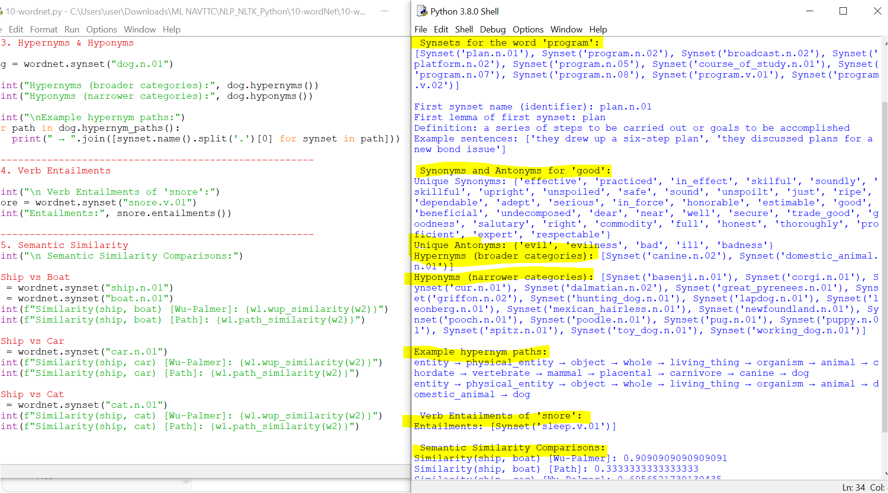

# 10 - WordNet with NLTK

This folder contains the Python script `10-wordnet.py` and its output screenshot `10-wordnet.PNG`.

---

## 📘 What is WordNet?
**WordNet** is a large lexical database of English developed at Princeton University.  
It groups words into **synsets** (sets of synonyms) and provides relationships such as synonyms, antonyms, hypernyms, hyponyms, meronyms, and semantic similarity.  

NLTK integrates WordNet, making it a powerful tool for natural language processing (NLP) tasks.

---

## 🚀 Features Demonstrated in `10-wordnet.py`

1. **Synsets Lookup**  
   - Find all synsets of a word.  
   - Access word definitions and usage examples.

2. **Synonyms and Antonyms**  
   - Extract synonyms and antonyms of words like `"good"`.

3. **Hypernyms & Hyponyms**  
   - Hypernyms = broader categories (e.g., *dog → canine*).  
   - Hyponyms = narrower categories (e.g., *dog → retriever*).  
   - Shows hypernym hierarchy paths.

4. **Holonyms & Meronyms** *(word-part relations)*  
   - Holonyms = words representing a **whole** (*forest* → *tree*).  
   - Meronyms = words representing a **part** (*tree* → *branch*).

5. **Verb Entailments**  
   - Discover actions that logically follow from another.  
     Example: *snore* entails *sleep*.

6. **Derivationally Related Forms**  
   - Explore words with related morphological forms.  
     Example: *develop → development, developer*.

7. **Semantic Similarity**  
   - Compare how closely two words are related using:
     - **Wu-Palmer similarity**  
     - **Path similarity**  
   - Examples: *ship vs boat*, *ship vs car*, *ship vs cat*.

---

## 📝 Example Output Highlights

- Synset of `"program"` → `plan.n.01`  
- Definition → *a series of steps to be carried out or goals to be accomplished*  
- Synonyms of `"good"` → {beneficial, upright, honest, …}  
- Antonyms of `"good"` → {bad, evil, …}  
- Hypernyms of `"dog"` → *canine.n.02*  
- Hyponyms of `"dog"` → *working_dog.n.01*, *lapdog.n.01*  
- Entailment of `"snore"` → *sleep*  
- Semantic similarity (ship vs boat) → **0.90**

---

## 📸 Output
- 
