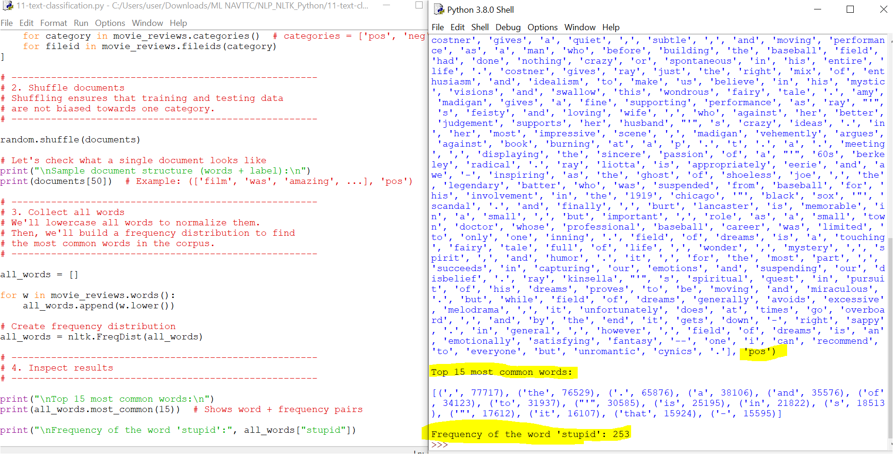

# 11 - Text Classification with NLTK (Movie Reviews)

This folder contains:
-   
-   

---

## 📘 Overview
**Text classification** is the process of assigning categories (labels) to text.  
Common applications include:
- Spam detection (spam / not spam)  
- Sentiment analysis (positive / negative)  
- News categorization (sports, tech, politics, etc.)  

In this example, we explore the **Movie Reviews corpus** from NLTK to begin building a **sentiment analysis system**.

---

## 🛠 Steps in the Script

### 1. Load the Dataset
- The `movie_reviews` corpus has **2000 labeled reviews** (1000 positive, 1000 negative).  
- Each review is converted into a tuple: `(list_of_words, category)`.

```python
documents = [
    (list(movie_reviews.words(fileid)), category)
    for category in movie_reviews.categories()
    for fileid in movie_reviews.fileids(category)
]
