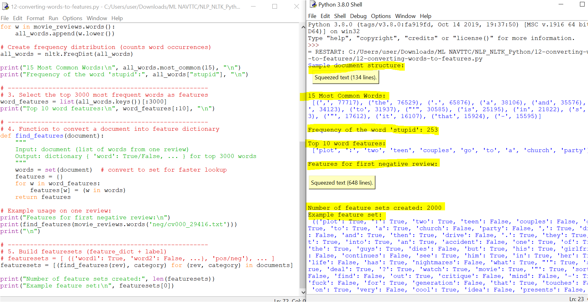

# 12 - Converting Words to Features

This folder contains the Python script `12-converting-words-to-features.py` and its output screenshot `12-converting-words-to-features.PNG`.

---

## 📘 Purpose
This step is about **feature extraction** — converting raw text from movie reviews into a format that can be used by machine learning algorithms.  
Instead of handling full sentences, we reduce each review into a **bag of features** that says whether certain important words appear or not.

---

## 🛠️ What the Code Does

1. **Load and Label the Data**  
   - We use the `movie_reviews` corpus from NLTK.  
   - Each review is paired with its label (`pos` or `neg`).  

   ```python
   documents = [(list(movie_reviews.words(fileid)), category)
                for category in movie_reviews.categories()
                for fileid in movie_reviews.fileids(category)]
   ```

2. **Shuffle the Dataset**  
   Randomize the order of reviews to avoid bias.  

   ```python
   random.shuffle(documents)
   ```

3. **Build a Frequency Distribution**  
   Count how often each word appears in the entire dataset.  

   ```python
   all_words = nltk.FreqDist(w.lower() for w in movie_reviews.words())
   ```

4. **Select Top Features**  
   Choose the **3000 most common words** to act as features.  

   ```python
   word_features = list(all_words.keys())[:3000]
   ```

5. **Define a Feature Extractor**  
   Create a function `find_features(document)` that checks whether each feature word appears in a review.  
   The result is a dictionary like:  

   ```python
   {'the': True, 'good': False, 'bad': True, ...}
   ```

6. **Build Feature Sets**  
   Apply `find_features()` to every review, producing `(features, label)` pairs.  
   This dataset is now ready for training machine learning models.  

   ```python
   featuresets = [(find_features(rev), category) for (rev, category) in documents]
   ```

---

## 🎯 Why This is Important
- Converts **raw text into numerical features** (True/False values).  
- Prepares the dataset for classification models like **Naive Bayes**, **Logistic Regression**, or **SVM**.  
- Forms the foundation for building a **sentiment analysis system**.

---

## 📸 Output
Here’s an example output showing feature extraction applied to one review:



---

## 🔗 Next Step
In the following file, we will use these feature sets to **train a text classifier** and evaluate its accuracy.
