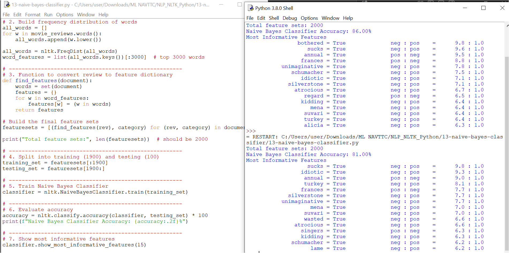

# 13 - Naive Bayes Classifier with NLTK

This folder contains the Python script `13-naive-bayes-classifier.py` and its output screenshot `13-naive-bayes-classifier.PNG`.

---

## 📘 Overview
Now that we’ve converted words into features, it is time to **choose a machine learning algorithm, split our dataset, and train the model**.  
Here we use the **Naive Bayes Classifier**, a popular algorithm for text classification.

---

## ⚙️ Steps Performed

1. **Dataset Preparation**  
   - We used the `movie_reviews` dataset from NLTK (2000 reviews, labeled *pos* or *neg*).  
   - Converted each review into a **feature dictionary** using the top 3000 most frequent words.

2. **Training & Testing Split**  
   - First **1900 reviews** → Training set  
   - Last **100 reviews** → Testing set  
   - This prevents **bias** (we don’t train and test on the same data).

3. **Supervised Learning**  
   - The algorithm is told “this review is positive” or “this review is negative” during training.  
   - After training, it predicts the label for **new unseen reviews**.

4. **Naive Bayes Classifier**  
   - Trained using NLTK’s `NaiveBayesClassifier`.  
   - Accuracy is calculated on the testing set.  
   - Most informative features (strongest indicators of *pos* or *neg*) are displayed.

---

## ✅ Output Example

- Accuracy of the classifier (usually **70–80%**).  
- A list of **most informative features** like words strongly linked to *positive* or *negative* reviews.  

