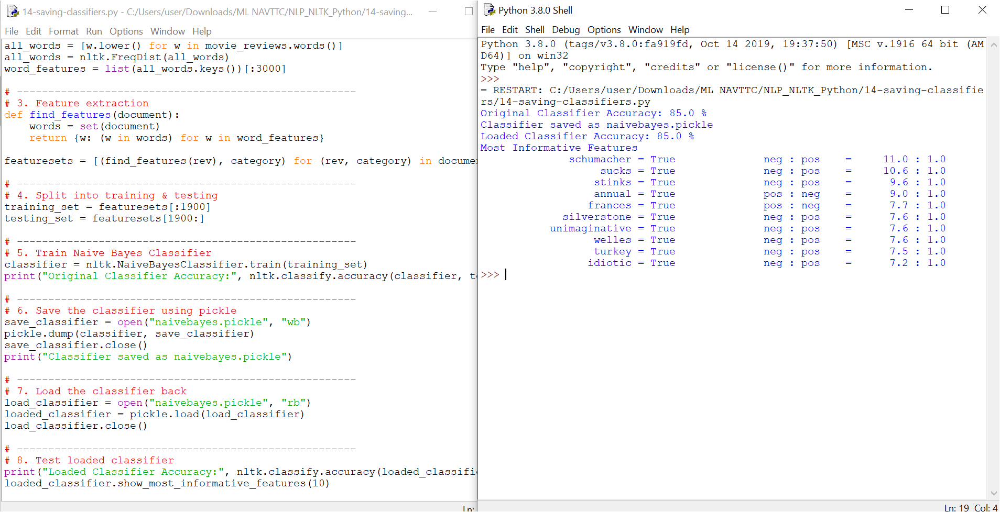

# 14 - Saving and Loading Classifiers

This folder contains the Python script `14-saving-classifiers.py` and its output screenshot `14-saving-classifiers.PNG`.

---

## 📘 Overview
In this step, we learn how to **save and reuse trained models**.  
This avoids retraining from scratch every time you run the program.

---

## ⚙️ Steps Performed

1. **Train Classifier**  
   - We train a Naive Bayes classifier on the movie reviews dataset (same as before).  

2. **Save with Pickle**  
   - The trained model is stored in a file `naivebayes.pickle`.  
   - `pickle.dump(classifier, file)` writes the model to disk.  

3. **Load Classifier**  
   - Later, we can load the model back using `pickle.load(file)` without retraining.  

4. **Verify Accuracy**  
   - The loaded classifier gives the same accuracy as the original.  
   - This confirms the model was saved and restored successfully.  

---

## ✅ Output Example
- Accuracy of the original and loaded classifier (should match).  
- A list of most informative features for classification.  

