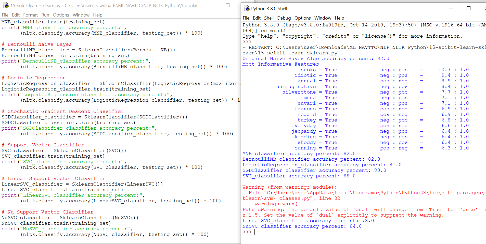

# 15-scikit-learn-sklearn.py

## Scikit-Learn with NLTK

In this script, we extend our sentiment analysis pipeline by combining **NLTK** with the **Scikit-Learn (sklearn)** machine learning library.  
NLTK provides the text preprocessing and feature extraction, while sklearn gives us access to a wide variety of powerful classifiers.

---

## What This Script Does
1. **Dataset Preparation**  
   - Loads the `movie_reviews` corpus (positive and negative reviews).  
   - Builds a frequency distribution of all words.  
   - Selects the **top 3000 most frequent words** as features.  

2. **Feature Extraction**  
   - Each review is converted into a dictionary of `{word: True/False}` for the top 3000 words.  
   - This creates feature sets in the form:  
     `({'word1': True, 'word2': False, ...}, 'pos/neg')`.  

3. **Training and Testing**  
   - Splits data into a **training set (1,900 reviews)** and a **testing set (100 reviews)**.  
   - First, trains a baseline **Naive Bayes classifier**.  
   - Then, evaluates multiple sklearn classifiers via `nltk.classify.scikitlearn.SklearnClassifier`.  

4. **Classifiers Used**  
   - Original Naive Bayes (NLTK)  
   - Multinomial Naive Bayes (`MultinomialNB`)  
   - Bernoulli Naive Bayes (`BernoulliNB`)  
   - Logistic Regression (`LogisticRegression`)  
   - Stochastic Gradient Descent (`SGDClassifier`)  
   - Support Vector Machine (`SVC`)  
   - Linear SVM (`LinearSVC`)  
   - Nu-Support Vector Machine (`NuSVC`)  

---

## Example Output
📸 **Screenshot of Output:**  

---

## Key Takeaways
- **Scikit-Learn integration with NLTK is seamless** using `SklearnClassifier`.  
- You can quickly experiment with multiple ML algorithms for text classification.  
- Results vary: some classifiers like **BernoulliNB** and **LinearSVC** often outperform plain Naive Bayes, while others like `SVC` may underperform.  
- This flexibility makes NLTK + sklearn a powerful combo for real-world NLP projects.
